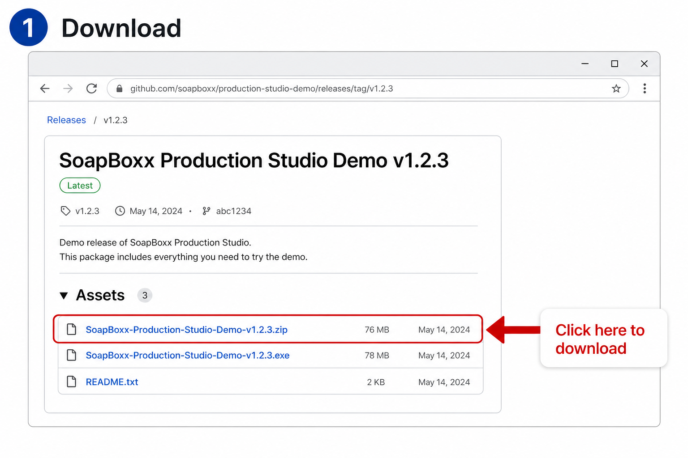
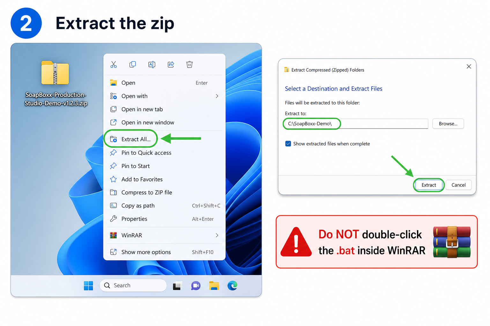
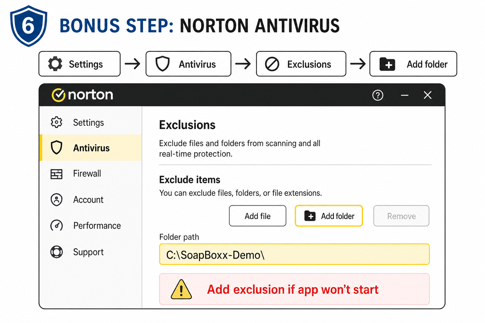
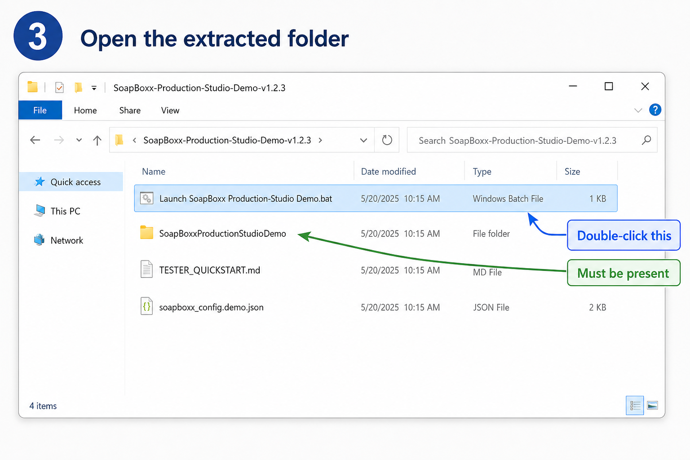
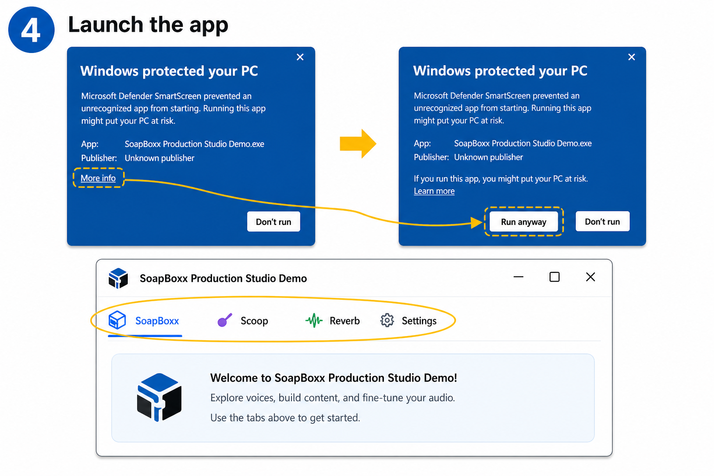
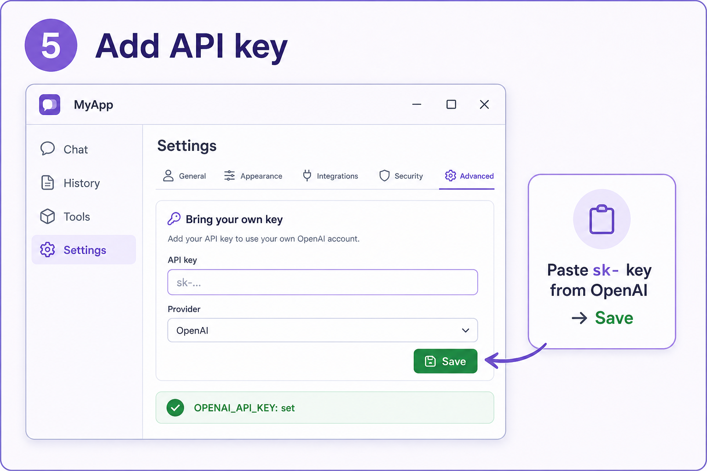
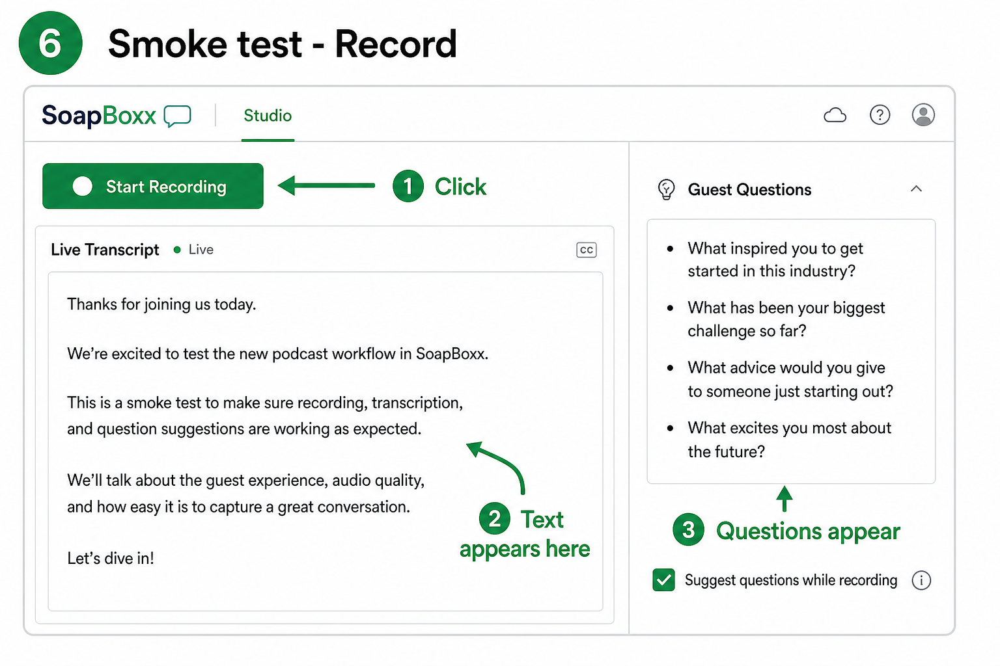

# SoapBoxx Demo — 15-Minute Tester Quickstart (with pictures)

Use this guide if nobody is walking you through setup live.  
**Latest demo:** [demo-v1.2.3 on GitHub Releases](https://github.com/bymediadev/SoapBoxx/releases/tag/demo-v1.2.3)

> **Tip:** For clickable pictures in one window, open **`TESTER_QUICKSTART.html`** in this folder (double-click → opens in your browser).

| Track | Time | What you get |
|-------|------|----------------|
| **A — Full demo** (OpenAI key) | ~12–15 min | Record → transcript → guest questions |
| **B — UI only** (no key) | ~8–10 min | Explore tabs and layout |
| **If Norton blocks the app** | +10–20 min | One-time exclusion |

---

## Step 1 — Download (~2 min)

1. Open: **https://github.com/bymediadev/SoapBoxx/releases/tag/demo-v1.2.3**
2. Under **Assets**, click **`SoapBoxx-Production-Studio-Demo-v1.2.3.zip`** (~76 MB).

> Use **v1.2.3** only. Older releases have known setup issues.

---

## Step 2 — Extract the whole zip (~2 min)

**Do not** open the `.bat` from inside WinRAR while the file is still “in” the zip.

1. **Right-click** the downloaded zip → **Extract All…**
2. Choose a simple folder, e.g. `C:\SoapBoxx-Demo\`
3. Click **Extract**
4. Open: `C:\SoapBoxx-Demo\SoapBoxx-Production-Studio-Demo-v1.2.3\`

You must see the **`SoapBoxxProductionStudioDemo`** folder next to the `.bat`. If you only see the `.bat`, extraction did not finish — repeat this step.

---

## Step 3 — Norton / antivirus (skip if not needed)

Only if the app will not start, or the **SoapBoxx** tab is blank / shows an error.

1. Norton → **Settings** → **Antivirus** → **Exclusions**
2. Add the **whole extracted folder** (e.g. `C:\SoapBoxx-Demo\`)
3. **Restore** anything quarantined named `SoapBoxxProductionStudioDemo`
4. Launch again (Step 4)

---

## Step 4 — Launch the app (~1 min)

1. Double-click **`Launch SoapBoxx Production Studio Demo.bat`**
2. First launch may take **15–30 seconds**
3. If Windows SmartScreen appears: **More info** → **Run anyway**

**Success:** window title includes **Production Studio Demo**; tabs **SoapBoxx**, **Scoop**, **Reverb**, **Settings**.

---

## Step 5 — API key (Track A only, ~3 min)

Your host’s keys do **not** travel inside the zip. Use **one** method:

**Option A — Paste in Settings (easiest)**

1. Open the **Settings** tab  
2. Paste your OpenAI key (`sk-…`) in **Bring your own key**  
3. Choose provider **OpenAI** if asked → **Save**

**Option B — `.env` file** (if your host emailed one)

1. Put the file in the extracted folder (next to the `.bat`)  
2. Rename it to exactly **`.env`**  
3. Close the app and run the `.bat` again  

**Track B — No key:** you can still explore the UI; live transcript needs a key.

---

## Step 6 — 5-minute smoke test (Track A)

1. **SoapBoxx** tab → wait until status is not stuck on “Initializing…”  
2. **Start Recording** → speak **10–15 seconds** → **Stop Recording**  
3. Confirm **Live Transcript** fills in  
4. Guest questions may appear if **Suggest questions while recording** is checked  

---

## Step 7 — Send feedback (~2 min)

Reply to your host with:

1. Which **step number** failed (if any)  
2. A **screenshot** of any error  
3. Norton / SmartScreen: yes or no  
4. Transcript worked: yes / no / partial  
5. One confusing thing + one thing you liked  

---

## Troubleshooting

| Problem | What to do |
|---------|------------|
| Cannot find `.exe` | Extract full zip (Step 2); don’t run `.bat` from WinRAR |
| SoapBoxx tab broken | Norton exclusion (Step 3) |
| Record disabled | Wait for init; add API key (Step 5); restart |
| No transcript | API key + check Windows mic permission |
| No questions | Need transcript first; wait ~30 s after speaking |

---

## How long should this take?

| Situation | Typical time |
|-----------|----------------|
| This guide + key, no AV issues | **12–15 min** |
| UI only | **8–10 min** |
| Norton / SmartScreen | **25–40 min** first time |
| No guide, on your own | Often **1–2 hours** |

---

## For the host

- Send: release link + this folder (or `TESTER_QUICKSTART.html`)  
- Optional: private `.env` with a **capped demo OpenAI key** (never on public GitHub)  
- Remind: **“Extract the whole zip before running the .bat.”**
